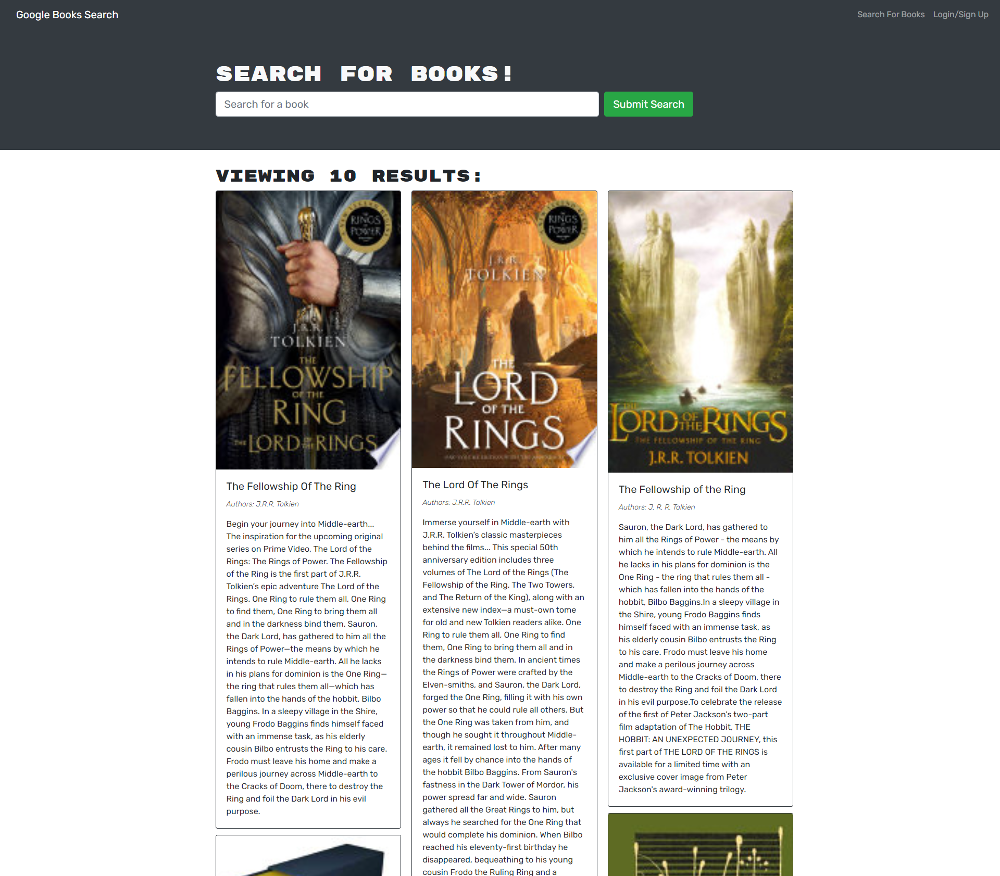
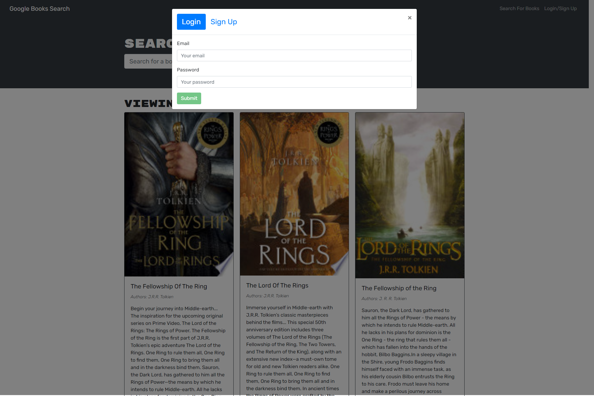
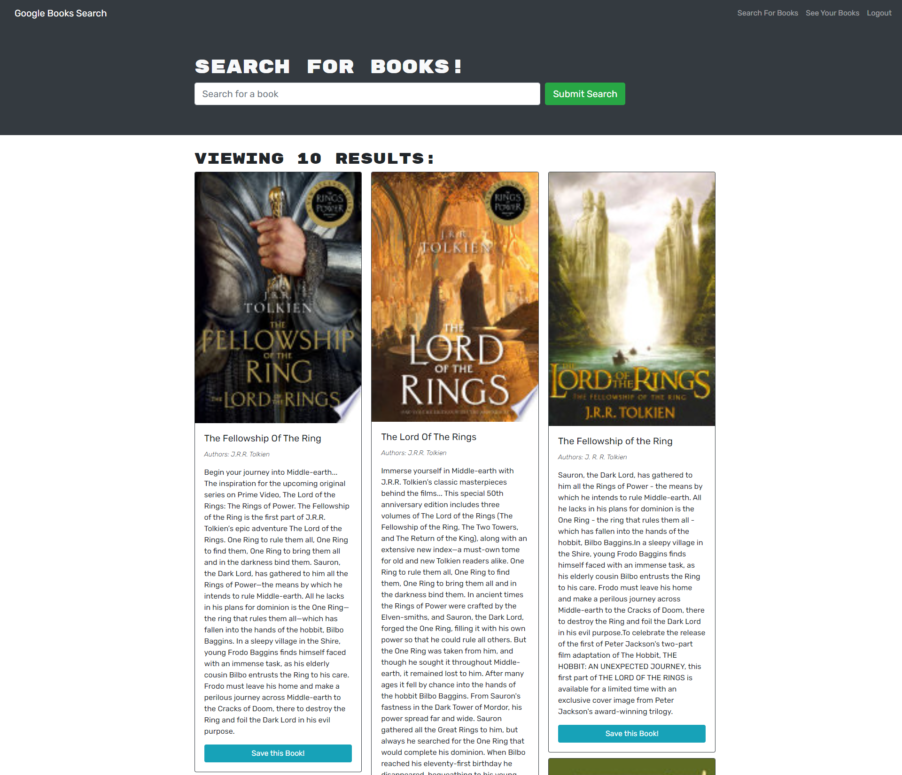
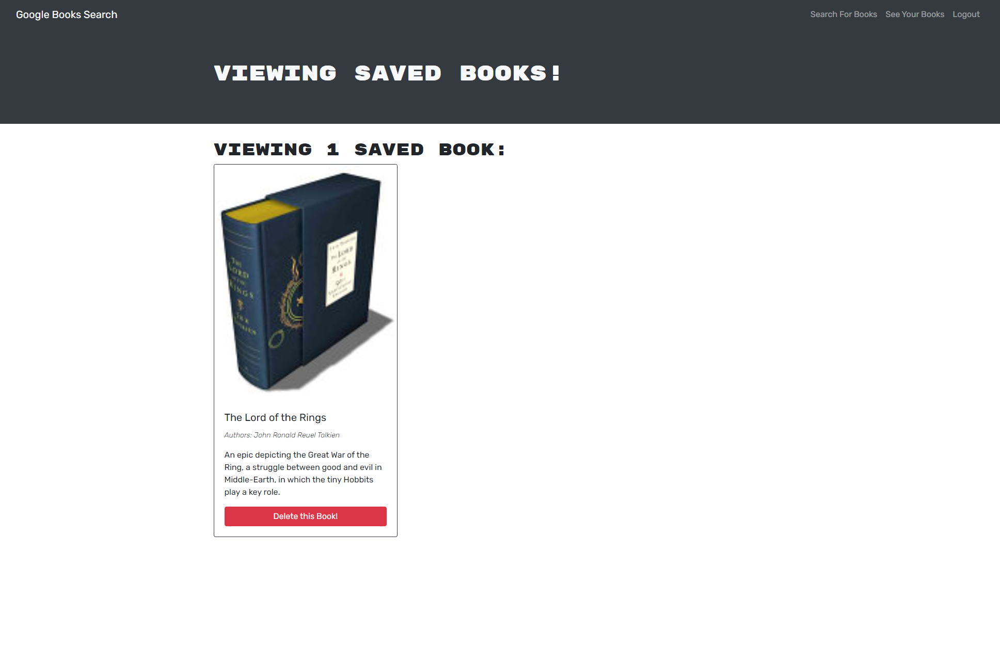

# book-search-engine

## License:

## Table of Contents 
- [Description](#description)
- [Installation](#installation)
- [Usage](#usage)
- [License](#license)
- [Contributing](#contributing)
- [Tests](#tests)
- [Questions](#questions)

## Description:
The search engine is built using the MERN stack - MongoDB, Express.js, React, and Node.js. A user can create an account, search for books, and save them to a list. On a separately rendered page, the user can see their saved books and remove books from the list.

Screenshots:

Homepage

Login

Homepage Logged-In

Saved Books

